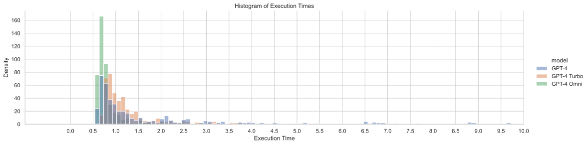
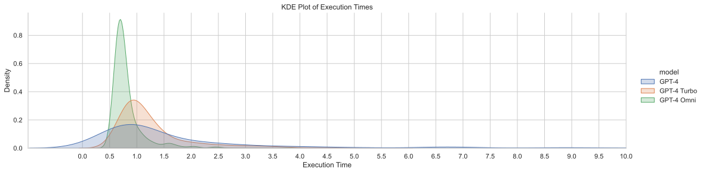

# Grace_Model_Benchmark
A Banch Mark for LLM's performance in Grace Project. Using self collected Cantonese Dataset.

<!-- SUMMARY_STATISTICS_PLACEHOLDER_BEGIN -->
|       |      GPT-4 |   GPT-4 Turbo |   GPT-4 Omega |
|:------|-----------:|--------------:|--------------:|
| count | 352        |    352        |    352        |
| mean  |   1.68904  |      1.25531  |      0.813637 |
| std   |   1.72989  |      0.734669 |      0.324275 |
| min   |   0.589304 |      0.617619 |      0.543163 |
| 25%   |   0.740127 |      0.839886 |      0.657005 |
| 50%   |   0.994632 |      1.00979  |      0.717785 |
| 75%   |   1.86759  |      1.33742  |      0.813343 |
| max   |  10.0983   |      5.39358  |      3.76859  |
<!-- SUMMARY_STATISTICS_PLACEHOLDER_END -->